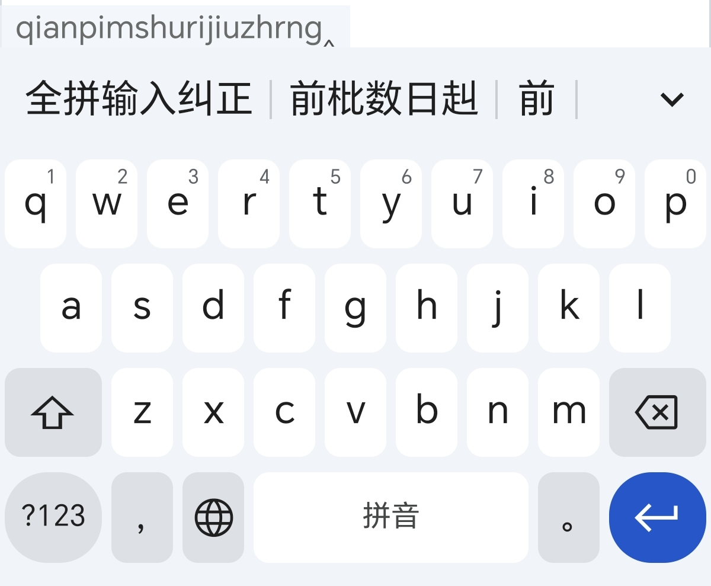
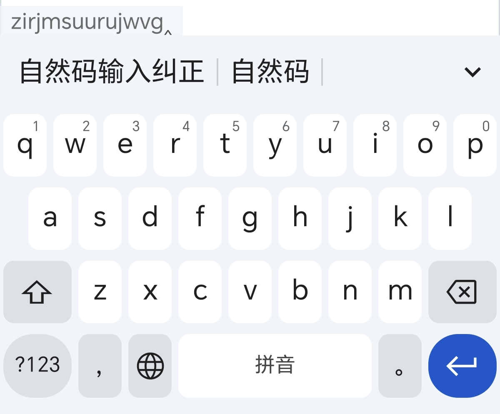
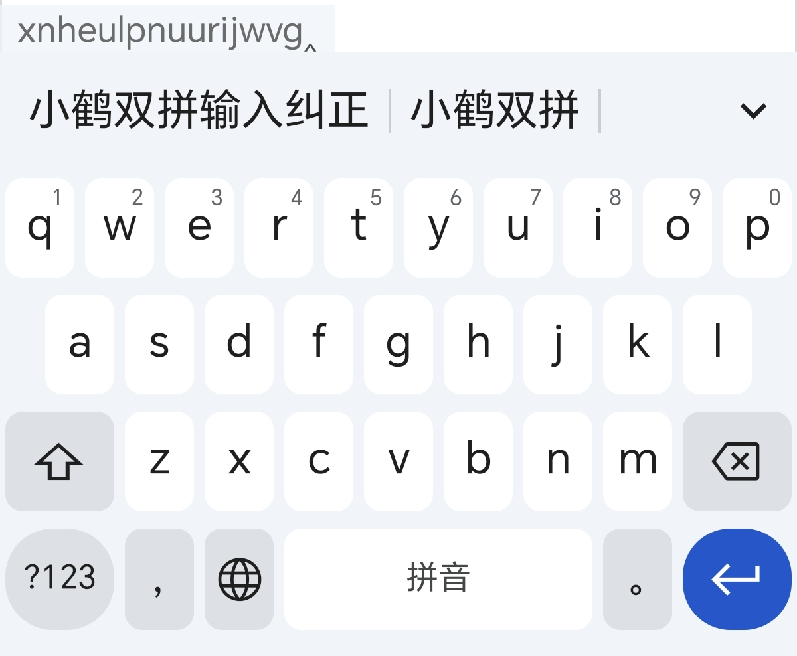

# rime-wanxiang-correct
基于万象PRO的全拼、自然码、小鹤双拼纠错扩展
# 教程
下载 [纠错扩展](https://github.com/x-skystar/rime-wanxiang-correct/releases/tag/v1.0.0) 并解压，将里面的文件放置在 Rime 个人用户文件夹 `lua/wanxiang`里，然后在 `wanxiang_pro.custom.yaml` 文件中追加补丁配置：
```
patch:
  engine/translators/+:
    - lua_translator@*wanxiang.correct
  engine/filters/+:
    - lua_filter@*wanxiang.correct*F
  correction:
    name: zrm
    enable: true
    beam: 10
    quality: 100
    strong_delta: 3.0
    topk: 2
    topk_seq: 2
    topk_legal: 2
    margin: 0.5
    margin_slope: 0.1
    weak_quality: 2
    w_learn: 30.0
    max_syllables: 12
    max_letters: 40
    light_query: true
  pinyin_light:
    dictionary: wanxiang_pro
    enable_sentence: false
    enable_user_dict: false
    enable_completion: false
    initial_quality: 3
    max_homophones: 8
```
其中，`name:` 需要根据所使用的方案进行填写，全拼用户填写 `pinyin`，自然码用户填写 `zrm`，小鹤双拼用户填写 `flypy`，重新部署即可。
# 相关说明
双拼用户使用 `/zjc` 即可查看双拼纠错是否生效；全拼用户使用 `/zjp` 即可查看全拼纠错是否生效；使用 `/zjcq` 即可清理纠错误学记录，保留正向纠错学习记忆。
# 纠错效果展示




